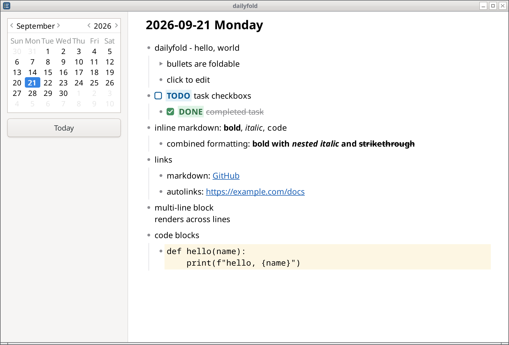

# dailyfold

A daily outliner based on Markdown files. GTK3.



Heavily inspired by [Logseq](https://logseq.com/)'s journal, and the files are (roughly) compatible. It implements all the Logseq features I used.

## Installing

There's a package available for Fedora:

```sh
sudo dnf config-manager addrepo --from-repofile=https://rian.id.au/rpm/rian.repo
sudo dnf install dailyfold
```

## Building

```
sudo dnf install rpm-build desktop-file-utils
scripts/build-rpm
```

The resulting package is written to `dist/`.

## Contributing

This is a personal project. If there's something you'd like to change, fork and make it your own!

## License

Copyright © 2026 Rian McGuire.

dailyfold is licensed under the GNU General Public License version 3. See
[LICENSE](LICENSE).
